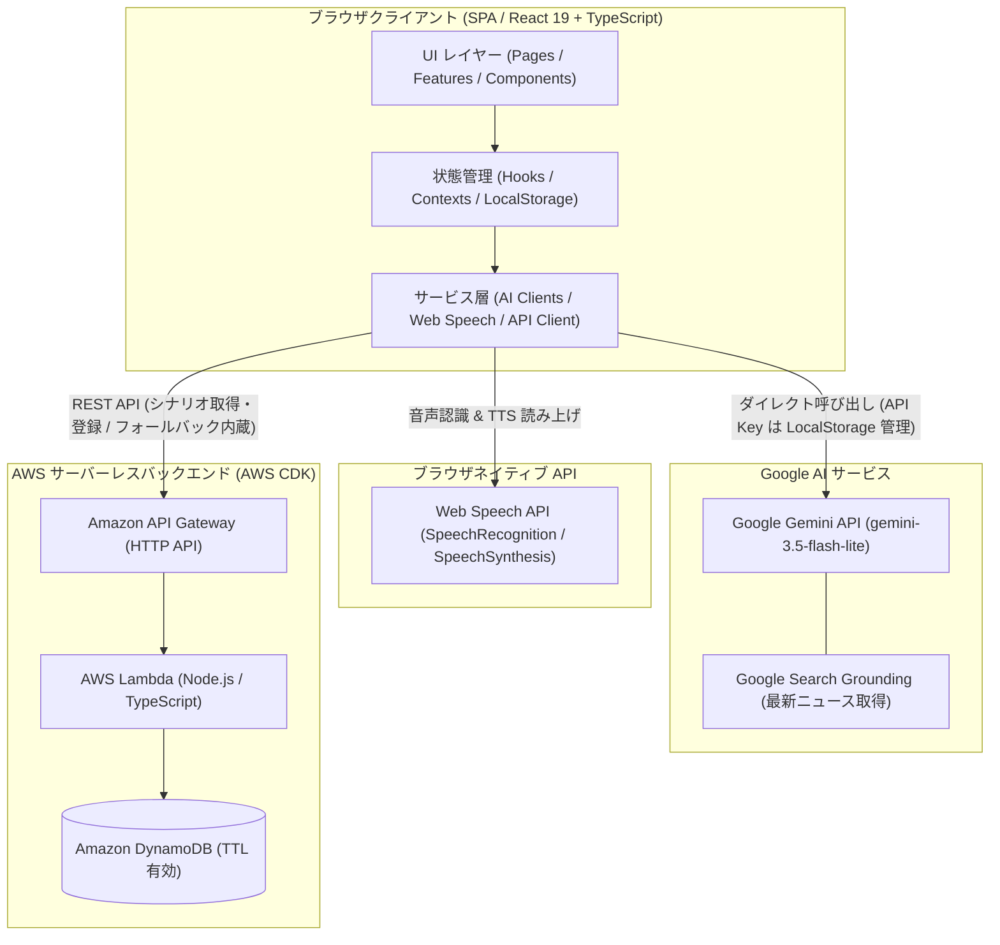
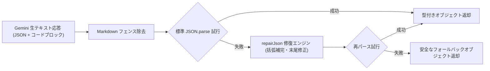
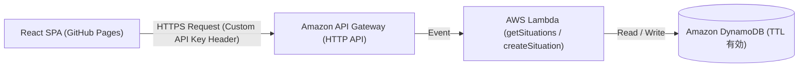
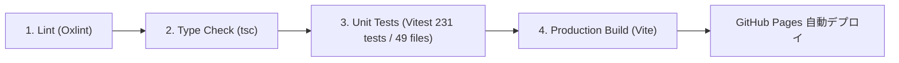

# 🏗️ SpeakFlow システムアーキテクチャ ＆ 技術仕様 (Technical Architecture)

本書では、**SpeakFlow (AI 英会話・シャドーイング・瞬間英作文 トレーニング)** のシステムアーキテクチャ、技術スタック、フロントエンド設計、AI エンジン連携、AWS インフラ、および CI/CD パイプラインについて解説します。

---

## 📚 目次

1. [システムアーキテクチャ全体像](#1-システムアーキテクチャ全体像)
2. [技術スタック (Tech Stack)](#2-技術スタック-tech-stack)
3. [フロントエンド設計](#3-フロントエンド設計)
4. [AI / LLM エンジン連携設計 (Google Gemini API)](#4-ai--llm-エンジン連携設計-google-gemini-api)
5. [バックエンド ＆ クラウドインフラ設計 (AWS CDK)](#5-バックエンド--クラウドインフラ設計-aws-cdk)
6. [品質保証 ＆ CI/CD パイプライン](#6-品質保証--cicd-パイプライン)

---

## 1. システムアーキテクチャ全体像

SpeakFlow は、クライアントサイド中心のモダンな Web アーキテクチャを採用しています。  
ブラウザ上で高速に動作する React 19 SPA を軸に、Google Gemini API と Web Speech API を直接活用し、低レイテンシでプライバシー安全な音声・AI 対話を実現しています。シナリオの動的配信・永続化には AWS サーバーレスインフラを連携させています。



---

## 2. 技術スタック (Tech Stack)

| レイヤー / 領域 | 採用技術 | バージョン / 備考 |
| :--- | :--- | :--- |
| **Frontend Core** | React | 19.x |
| **Language** | TypeScript | 7.0.x (`strict: true`) |
| **Routing** | React Router | 7.x |
| **Build Tool** | Vite | 8.x |
| **Styling** | Modular Vanilla CSS | Tokens, Base, Components, Features, Responsive |
| **AI Engine** | Google Gemini API | `@google/genai` (`gemini-3.5-flash-lite`) |
| **Speech Engine** | Web Speech API | `webkitSpeechRecognition`, `SpeechSynthesis` |
| **Backend / IaC** | AWS CDK (TypeScript) | v2 |
| **Compute / DB** | AWS Lambda / Amazon DynamoDB | Node.js 24.x, Single-table design (TTL) |
| **API Gateway** | Amazon API Gateway | HTTP API (CORS & Domain Verification) |
| **Testing** | Vitest, React Testing Library | 49 テストファイル / 231 テスト網羅 |
| **Linting** | Oxlint | 高速 Rust 製リンター |
| **Icons** | Lucide React | |
| **Hosting & CI/CD** | GitHub Pages, GitHub Actions | 4段階品質ゲート自動検証 |

---

## 3. フロントエンド設計

### 3.1. ディレクトリ構造と責務 (Feature-Driven Architecture & 100% TypeScript)

SpeakFlow はフロントエンドコードベースの **100% TypeScript (`.ts` / `.tsx`) 化** を達成しており、責務ごとに明確に分離された Feature-Driven な構成をとっています。

```
src/
├── components/
│   └── common/           # 汎用 UI コンポーネント (Header, Modal, MicButton, PageHeader, AiGeneratorCard, CategoryFilter, AudioPlayButton, StatCard 等)
├── constants/             # 共通定数 (難易度設定 difficulty.ts 等)
├── contexts/             # グローバル状態 (SettingsContext: API Key/モデル, CoachContext: リアルタイム学習コンテキスト・正誤状況)
├── data/                 # 静的マスターデータ (プリセットシチュエーション、シャドーイングスクリプト等)
├── features/             # ドメイン別モジュール (UI + 専用ロジック・フック + テスト)
│   ├── blitz/            # 瞬間英作文機能
│   │   ├── BlitzSession.tsx, BlitzSpeechBox.tsx, BlitzAnswerPanel.tsx, BlitzEvaluationPanel.tsx, BlitzSummary.tsx, BlitzTopicSelector.tsx
│   │   ├── useBlitzSession.ts (セッションライフサイクル管理フック)
│   │   ├── useBlitzTimer.ts (回答制限タイマーフック)
│   │   ├── useBlitzSpeech.ts (音声認識・発話待機制御フック)
│   │   └── data/blitzTopics.ts (基礎構文100問 ＆ シチュエーション即レスデータ)
│   ├── coach/            # 全画面常駐 AI コーチングアシスタント
│   │   ├── FloatingCoachWidget.tsx (フローティングUIオーケストレーター)
│   │   ├── CoachContextBanner.tsx (出題中の問題・回答状況のコンテキスト表示)
│   │   ├── CoachMessageItem.tsx (個別コーチメッセージ表示)
│   │   └── coachPrompts.tsx (シチュエーション・正誤適応型クイック質問プリセット)
│   ├── conversation/     # ロールプレイ英会話機能
│   │   ├── ChatRoom.tsx, ChatSidebar.tsx, ChatInputBar.tsx, MessageItem.tsx
│   │   ├── HintPanel.tsx (3段階返答ヒント), ReportModal.tsx (総合診断レポート)
│   │   ├── SituationSelector.tsx (シチュエーション選択)
│   │   └── NewsGeneratorSection.tsx (動的ニュース対話生成)
│   └── shadowing/        # シャドーイング特訓機能
│       ├── ShadowingPlayer.tsx, ShadowingSelector.tsx, ShadowingAudioControls.tsx, ShadowingEvaluationCard.tsx, ShadowingScriptViewer.tsx
│       └── useShadowingSession.ts (シャドーイングセッション制御フック)
├── hooks/                # 再利用可能カスタムフック (useChatSession, useSpeechRecognition, useAudioPlayer, useSettings, useCoach 等)
├── pages/                # トップレベル画面ページ (ConversationPage, InstantBlitzPage, ShadowingPage)
├── services/             # 外部通信・AI・API クライアント層 (純粋 TypeScript)
│   ├── ai/               # Gemini API モジュール (client.ts, chat.ts, blitz.ts, coach.ts, shadowing.ts, news.ts)
│   ├── api.ts            # DynamoDB API クライアント (ローカルフォールバック内蔵)
│   ├── gemini.ts         # Gemini サービス統括エントリポイント
│   └── speech/           # Web Speech API 統括モジュール (stt.ts, tts.ts, audioManager.ts, index.ts, types.ts)
├── styles/               # モジュラー CSS アーキテクチャ
│   ├── tokens.css        # デザイントークン (色、フォント、シャドウ、余白)
│   ├── base.css          # リセット、レイアウト、ユーティリティ
│   ├── components.css    # 共通コンポーネント用スタイル
│   ├── responsive.css    # モバイル固定ボトムナビ・メディアクエリ
│   └── features/         # 機能別固有 CSS (conversation, blitz, shadowing, coach)
├── types/                # 厳格な TypeScript ドメイン型定義 (index.ts)
└── utils/                # 共通ヘルパー (jsonRepair.ts, textMatcher.ts 等)
```

### 3.2. スタイリングアーキテクチャ (Modular CSS)
- CSS フレームワークに依存せず、**Vanilla CSS によるモジュラー構成**を採用。
- `tokens.css` で CSS カスタムプロパティ（CSS 変数）を一元管理し、ダーク/ライトの統一テーマを提供。
- 各画面や機能ごとのスタイルは `styles/features/` に分離し、インラインスタイルを排除してクラス名による一貫したデザインを担保。
- モバイル表示時は `responsive.css` により、固定ボトムナビゲーションを含む専用レイアウトへ自動適応。

### 3.3. 状態管理とハイブリッド Context アクセス (Prop Drilling の完全解消)
- **`SettingsContext`**: API Key、選択モデル、モーダル制御などを管理。深い階層のコンポーネントから `useSettings()` フックを通じて直接アクセスし、親コンポーネントでの不要な Props バケツリレー（Prop Drilling）を排除。
- **`CoachContext`**: アプリケーション全体で現在アクティブな学習画面（ロールプレイ、瞬間英作文、シャドーイング）、出題中の問題文、模範解答、ユーザー発話/回答内容、および合否判定ステータスをリアルタイムに共有。右下の `FloatingCoachWidget` はこのコンテキストを自動購読し、ユーザーが今まさに直面している課題に応じた的確な助言やクイック質問を提供します。
- 各セレクター（`SituationSelector`, `ShadowingSelector`, `BlitzTopicSelector` など）は **ハイブリッド設計** を採用：
  ```tsx
  const settings = useSettings();
  const apiKey = propsApiKey !== undefined ? propsApiKey : (settings.apiKey || '');
  const model = propsModel !== undefined ? propsModel : (settings.model || 'gemini-3.5-flash-lite');
  ```
  Props が省略された場合は自動的に Context から取得し、テスト時やStorybookなどの分離環境では外部から Props を明示注入できる柔軟性とテスタビリティを両立しています。

---

## 4. AI / LLM エンジン連携設計 (Google Gemini API)

### 4.1. モデル選定: `gemini-3.5-flash-lite`
- **低レイテンシ・高スループット**: リアルタイムな会話テンポや瞬間英作文の即時添削において、体感レイテンシを極限まで低減。
- **高精度な推論力**: 会話全体の総合診断、文脈に応じた Better Phrasing、瞬間英作文の柔軟な合否判定を高い品質で実行。

### 4.2. 構造化出力 (Structured Outputs) ＆ Safe JSON Self-Healing パース
- **課題**: LLM の JSON 出力には、Markdown コードブロックの混入、末尾のカンマ抜け、引用符のアンエスケープ、不完全な閉じ括弧などの不確実性（不完全な JSON）が伴います。
- **対策**:
  - `src/utils/jsonRepair.ts` に **自己修復パース機能 (`repairJson`)** を実装。
  - 正規表現による Markdown フェンス除去、不完全な JSON 終端の自動補完、サニタイズ処理を経由することで、パースエラーによるアプリクラッシュを完全に防御。



### 4.3. Google Search Grounding による動的シナリオ生成
- `services/ai/news.ts` では Gemini の Search Grounding ツールを活用。
- 「最新のテクノロジーニュース」「ビジネス動向」などのクエリからリアルタイムな Web 検索を行い、取得した情報ソース（Grounding Citations）を元に対話シナリオを動的に生成します。

---

## 5. バックエンド ＆ クラウドインフラ設計 (AWS CDK)

バックエンドインフラは `cdk/` ディレクトリ配下に **AWS CDK (TypeScript)** でコード化（IaC）されています。



### 5.1. 主要コンポーネント
- **Amazon DynamoDB**:
  - 会話シチュエーションおよび生成されたニュースシナリオを格納。
  - **TTL (Time To Live)** 属性を設定し、古い動的ニュースシナリオは自動的に削除されるサーバーレス運用。
- **AWS Lambda**:
  - `getSituations.ts`: シチュエーション一覧取得ハンドラー。
  - `createSituation.ts`: 新規シナリオ登録ハンドラー。
- **Amazon API Gateway (HTTP API)**:
  - 低コスト・低レイテンシな HTTP API を採用。

### 5.2. 多層セキュリティ防護
1. **CORS 制限**: 許可されたドメイン（GitHub Pages およびローカル開発環境）からのアクセスのみを許可。
2. **Origin / Referer ドメイン検証**: Lambda レベルでリクエストヘッダーを検査し、不正なドメインからの不正呼び出しを遮断。
3. **カスタム API Key ヘッダー照合**: `x-api-key` ヘッダーによる簡易認証を実施。

### 5.3. Graceful Degradation (堅牢なフォールバック)
- AWS バックエンドが未デプロイ、またはネットワーク切断時でも、フロントエンドの `services/api.ts` が自動的にローカルのプリセットデータ（`src/data/situations.ts`）にフォールバックします。
- ユーザー体験を損なうことなく、完全ローカル環境でも全機能が動作します。

### 5.4. バックエンドのデプロイ手順
```bash
cd cdk
npm install

# 単体テストの実行
npm test

# 初回のみ Bootstrap
npx cdk bootstrap

# デプロイ
npx cdk deploy
```
デプロイ後に出力された `ApiEndpointUrl` および `ApiKeyHeaderValue` を、フロントエンドの環境変数（`.env.local` または GitHub Repository Secrets）に設定します。詳細は [cdk/README.md](../cdk/README.md) を参照してください。

---

## 6. 品質保証 ＆ CI/CD パイプライン

### 6.1. 4段階の品質ゲート (Quality Gates)
SpeakFlow は品質と安全性を担保するため、コミットおよび PR 時点で以下の4つの自動チェックを実施します：



1. **Lint (`npm run lint`)**: Oxlint による高速コード解析。
2. **Type Check (`npm run typecheck`)**: TypeScript コンパイラ (`tsc --noEmit`) による厳格な型検証。
3. **Unit Tests (`npm test`)**: Vitest による 49 テストファイル / 231 テストの自動実行。
4. **Production Build (`npm run build`)**: Vite によるバンドルと最適化。

### 6.2. CI/CD パイプライン (`deploy.yml`)
- `.github/workflows/deploy.yml` により、`main` ブランチへの push 時に GitHub Actions が起動。
- 4つの品質ゲートをすべて通過した場合にのみ、`dist/` ディレクトリの成果物が `GitHub Pages` へ安全に自動デプロイされます。
